1.骨干节点接入
=========================

## 1.1 前言

### **1.1.1编写目的**

本文档旨在指导骨干节点/骨干链接入，包含接入流程、接入内容和开发规范。接入方式**先通过星火·链网超级节点测试网络平台进行测试验证**，接入测试成功后再接入超级节点正式系统。

### **1.1.2 环境**

1）北京超级节点

测试网络平台：[http://test-bj-baas.bitfactory.cn](http://test-bj-baas.bitfactory.cn)

生产系统：[https://bj-baas.bitfactory.cn](https://bj-baas.bitfactory.cn)

2）重庆超级节点

测试网络平台：[http://test-cq-baas.bitfactory.cn](http://test-cq-baas.bitfactory.cn)

生产系统：[https://cq-baas.bitfactory.cn](https://cq-baas.bitfactory.cn)

### **1.1.3 参考文档**

参考文档：《钱包使用手册》、[《星火·链网超级节点开放平台API 》](https://bif-open-api-doc.readthedocs.io/zh_CN/latest/index.html)、[《BID协议》](https://bid-resolution-protocol-doc.readthedocs.io/zh_CN/latest/)

## 1.2 通用说明

### 1.2.1 名词解释

**API_key** 开发者的身份ID，可用于获取骨干节点的调用凭证（access_token），然后通过接口调用凭证再来访问开放平台API。

**API_secret** 开发者身份ID对应的密钥，配合API_key使用能够获取接口调用凭证，同时为了安全起见这个密钥需要妥善保管。

**accessToken** 所有API接口的调用凭证，通过API_key和API_secret调用相关接口获得，具有时效性，有效时间为2小时， 过期后需要重新获取否则会调用接口失败，因为凭证获取的接口有调用次数限制，所以建议妥善保存并管理。

**AC号** 自治共识域为边界的跨链互通能力（ACSN，Autonomous Consensus System Number），简称共识域号，即AC号，AC号是由四位小写字母和数字组成，代表各区块链在星火·链网中唯一合法身份，是星火·链网体系中区分不同区块链共识区域的代号，用于区块链身份识别及全网寻址功能。

**BID** 区块链上标记某个对象唯一分布式标识。

**publicKey、privateKey** 公钥和私钥是建立在区块链网络上不可缺少的组成部分，链上发起交易都是需要私钥来签名的。私钥可以恢复公钥，但是，仅使用公钥是不可能找到私钥的。

**blob** 星火·链网上交易结构序列化后的十六进制格式，用于执行上链操作。

**backboneNodeBid** 骨干节点BID，成为骨干节点时 可以登录星火链网 业务管理平台查看骨干节点BID。

**gatewayAddress** 网关节点账户bid，骨干节点为下属子链上报信息时，需要使用这个账户发起交易。

**跨链合约** 部署跨链合约后可支持主链积分转移、子链积分转移、数据跨链、智能合约跨链互操作功能。

**网关节点地址** 子链将数据通过链网关账户锚定到国家主链。

**服务商** 是指经有效申请并通过星火市场验证，入驻星火·链网星火市场，并通过星火市场向用户进行在线销售服务的企业。

**应用服务** 是指服务商在星火市场发布的应用类服务，用户购买后可以通过已购服务列表中授权BID后直接访问服务商提供的外部系统或平台。

**开发服务** 是指服务商在星火市场发布的开发类服务，如提供多维度的区块链软件能力、行业解决方案，为企业实现一站式区块链业务赋能。开发服务目前可支持API类和交付类两大分类。

**服务调用剩余时长** 是指用户在星火市场上购买设置按时计费的API类开发服务，在已购服务详情中可以查看该服务的剩余时长。

**服务调用剩余次数** 是指用户在星火市场上购买设置按次计费的API类开发服务，在已购服务详情中可以查看该服务的剩余次数。

### **2.2 BID-SDK-JAVA使用说明**

首先下载BID-SDK-JAVA,下载地址  [https://github.com/CAICT-DEV/BID-SDK-JAVA](https://github.com/CAICT-DEV/BID-SDK-JAVA)

 **（1）生成区块链账户(地址、公钥、私钥）私钥需要自己妥善保管**

使用SDK生成账户示例：

```java
SDK bidSdk = new SDK();

KeyPairEntity kaypairEntity = bidSdk.getBidAndKeyPair();

String publicKey = kaypairEntity.getPublicKey();

String privateKey = kaypairEntity.getPrivateKey();

String bid = kaypairEntity.getBid();
```

**（2）如果账户需要向链上发起交易，需要账户私钥进行签名**，签名示例： 

```java
SDK bidSdk = new SDK();

byte[] signByte = bidSdk.signBlob(privateKey,HexFormatUtil.hexStringToBytes(blob));

String signBlob = HexFormat.byteToHex(signByte);
```

## 1.3 骨干节点接入

### **1.3.1 接入内容及流程**

#### **1.3.1.1 接入内容**

骨干节点需根据本文档及[《星火·链网超级节点开放平台API 》](https://bif-open-api-doc.readthedocs.io/zh_CN/latest/index.html)、[《BID协议》](https://bid-resolution-protocol-doc.readthedocs.io/zh_CN/v1.9.4/)要求开发接入主链，将骨干节点及其子链信息同步至主链锚定，实现与主链的互联互通，并且在实际业务中应用BID。为实现以上目标，至少需要接入以下内容：

1）获取数字身份：下载插件钱包后，注册账号、创建数字身份、申请星火企业可信认证数字凭证。

2）节点申请：通过插件钱包登录到星火服务平台，进行骨干节点申请、开放平台API调用权限申请。

3）底层链锚定：开放平台API调用权限申请通过后，通过该接口向主链锚定 骨干链/子链 的底层链信息，包含：链基础信息同步、链状态信息同步、链节点信息同步、链的区块信息同步、合约信息同步、交易信息同步。参考[《星火·链网超级节点开放平台API 》](https://bif-open-api-doc.readthedocs.io/zh_CN/latest/index.html)中 [底层链锚定章节](https://bif-open-api-doc.readthedocs.io/zh_CN/latest/docs/API接口/4-底层链锚定.html) 进行开发。

4）同步业务数据：开放平台API调用权限申请通过后，通过该接口向主链同步链上业务统计数据。由于不同链上业务数据不同，需提前和信通院沟通确定同步的数据字段。参考[《星火·链网超级节点开放平台API 》](https://bif-open-api-doc.readthedocs.io/zh_CN/latest/docs/API%E6%8E%A5%E5%8F%A3/3-%E5%BA%95%E5%B1%82%E9%93%BE%E4%B8%9A%E5%8A%A1%E6%8E%A5%E5%85%A5.html#id14)中 **链应用服务信息同步** 接口实现。

5）BID标识应用于实际业务：

- 标识注册、标识解析。参考本文档3.3节开发规范、《星火·链网超级节点开放平台API 》中 标识注册、标识解析 及《BID协议》进行开发。
- 将BID标识应用于当前的业务中。由于不同骨干节点/骨干链上业务不同，需和信通院详细沟通，可能需要对骨干链上现有业务进行改造。

**说明：**

- **以上 1）~4）部分内容全部接入后即对接成功，测试环境对接成功后才可接入生产环境。**
- 除以上内容，**3.3开发规范中的其他内容可视需求进行接入**，比如跨链、服务共享、数据共享等。
- 骨干节点接入时，需要参考《钱包使用手册》、[《星火·链网超级节点开放平台API 》](https://bif-open-api-doc.readthedocs.io/zh_CN/latest/index.html)、[《BID协议》](https://bid-resolution-protocol-doc.readthedocs.io/zh_CN/v1.9.4/)。**请确认拿到的文档为最新版**。

#### **1.3.1.2 接入流程**

​     骨干节点接入主链分为**线上注册申请**和**线下开发**两部分内容，具体流程如下图所示，蓝色标记部分需要骨干节点登录超级节点服务平台进行操作 ：

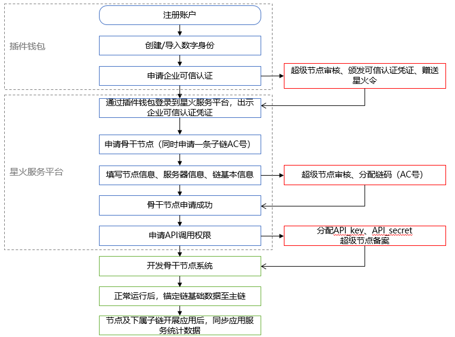

### **1.3.2** **创建数字身份**

#### **1.3.2.1** **安装插件钱包**

第一步：打开谷歌浏览器，访问星火服务平台（用户想要接入哪个超级节点，就登录该超级节点服务平台执行申请操作），根据引导下载插件钱包。

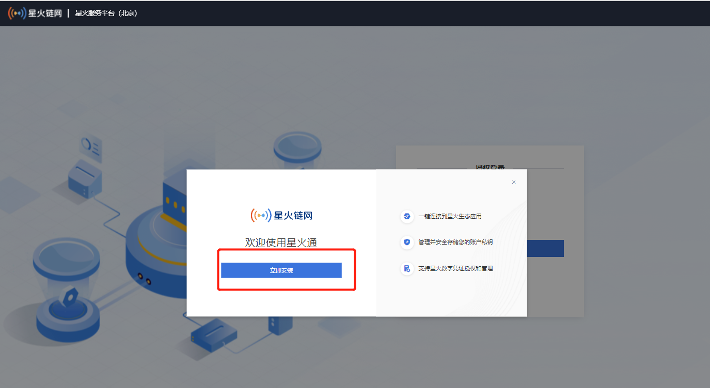

下载解压后，安装插件钱包，并在插件钱包中创建账户、进行企业可信认证，具体说明见 [浏览器插件钱包 — 星火·链网开放文档 0.1 文档 (bif-doc.readthedocs.io)](https://bif-doc.readthedocs.io/zh_CN/latest/tools/wallet.html#)

如之前已安装插件钱包，并完成账户创建、可信认证，可直接通过插件钱包授权登录星火服务平台：

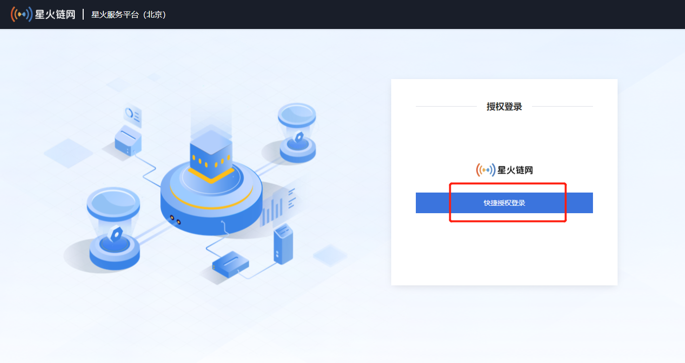

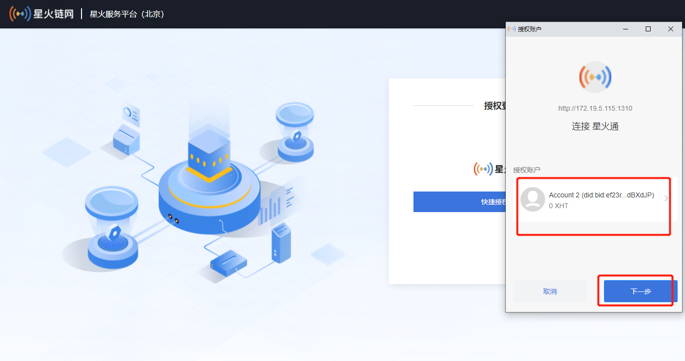

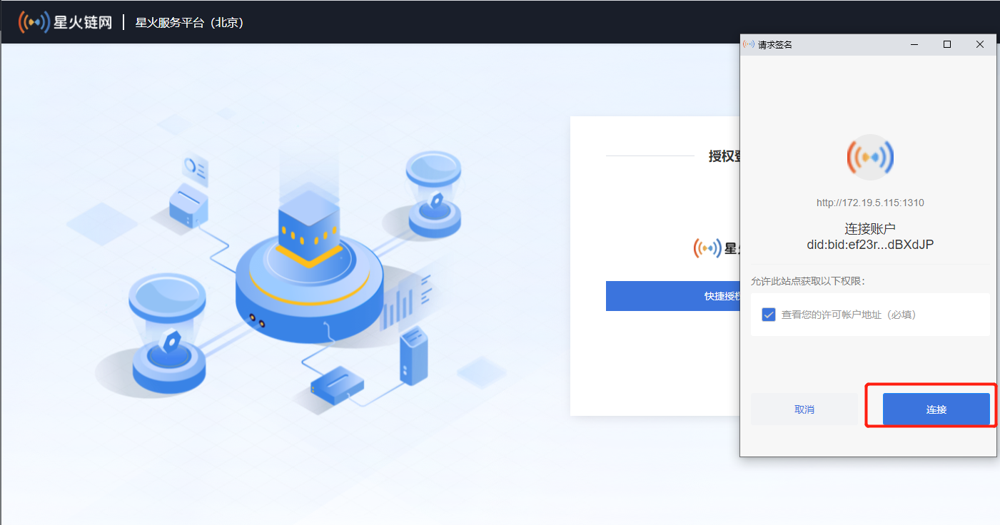


授权成功后，进入到星火服务平台账户中心

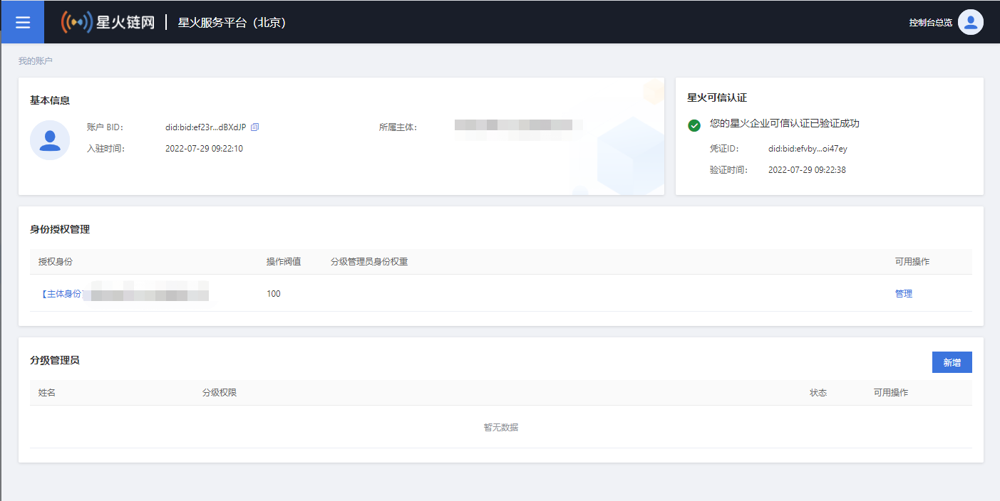


#### **1.3.2.2 申请骨干节点**

准备工作：使用BID-SDK-JAVA线下生成一个网关账户地址（公钥私钥也要保存好），为下一步申请成为骨干节点时配置接入网关地址时使用（可以生成多个）。也可通过插件钱包创建一个数字身份bid作为网关账户地址。


第一步：进入星火服务平台后，点击左上角菜单按钮，选择进入基础业务平台：

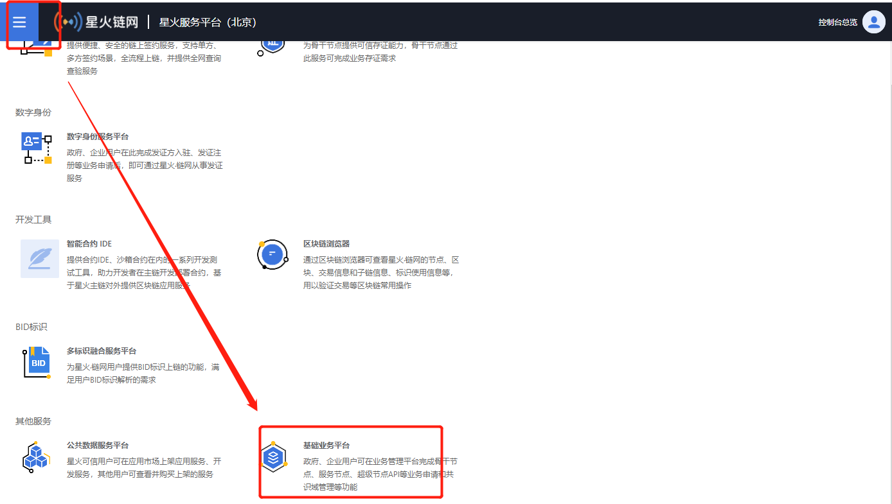


第二步：进行节点申请。进入节点管理--节点申请--申请骨干节点（准备工作中生成的网关地址写到服务器信息的“数据网关BID列表中”）

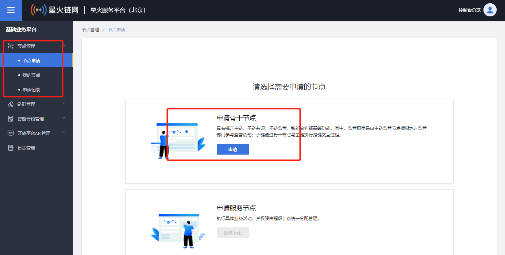

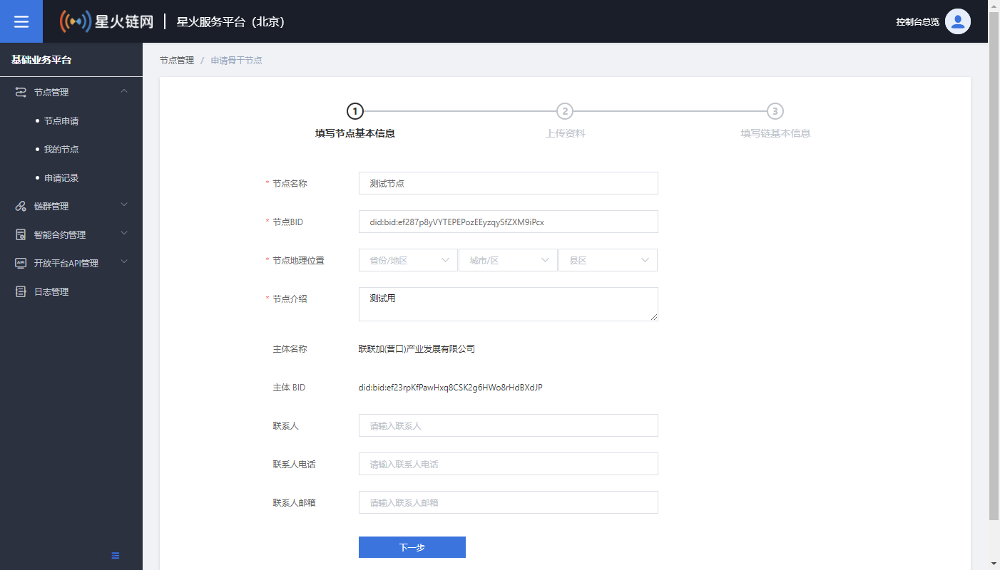

说明：

- 节点BID由用户自己填写。可通过BIDSDK生成，也可通过插件钱包生成。需注意：该BID不能绑定企业，及不能进行企业可信认证。同时，该BID需通过转账进行激活。激活后，即可填写进来作为骨干节点BID，否则无效。


第三步：填写链基本信息

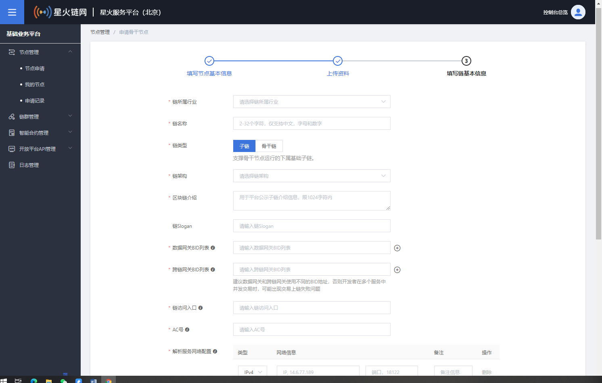

说明：

- AC号：可自定义，最终以超级节点审核结果为准（超级节点审核时可修改AC号）
- 解析服务网络地址：子链解析服务网络地址（子链开发bid注册解析服务时用到）
- 链架构类型：如链架构类型中，没有子链的链结构类型，可联系信通院同事进行添加


申请完成后，等待所属超级节点审核；审核通过后才能进行下一步API申请操作。申请进度可通过申请记录查看：


超级节点审核完成后，即骨干节点身份申请成功，骨干节点相关业务以骨干节点身份开展。


#### **1.3.2.3 申请API调用权限**

申请成为骨干节点后，需要申请API调用权限才可调用API服务。

第一步：申请骨干节点API_key和API_secret，在基础业务平台-开放平台API管理模块中进行APIKey申请，

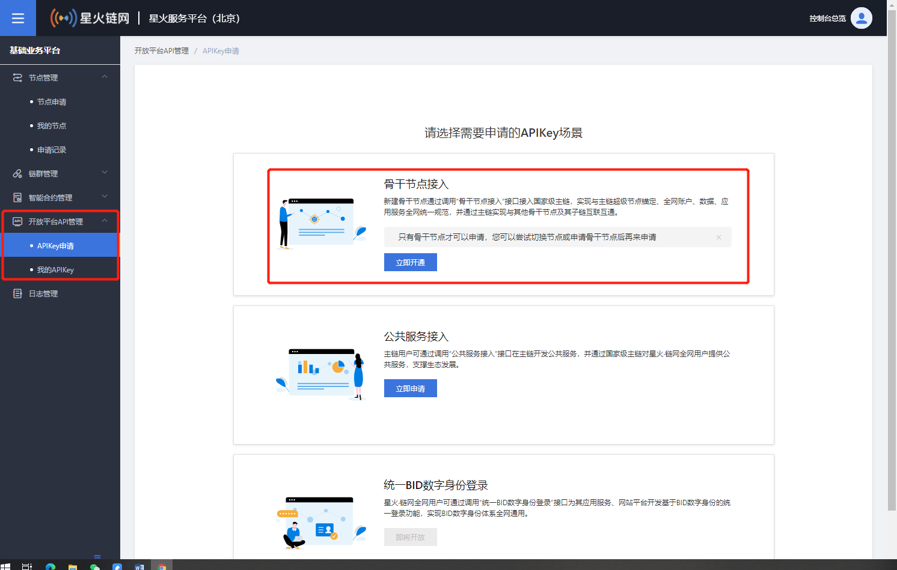

开通时，授权账户要选择前一步申请的骨干节点账户：

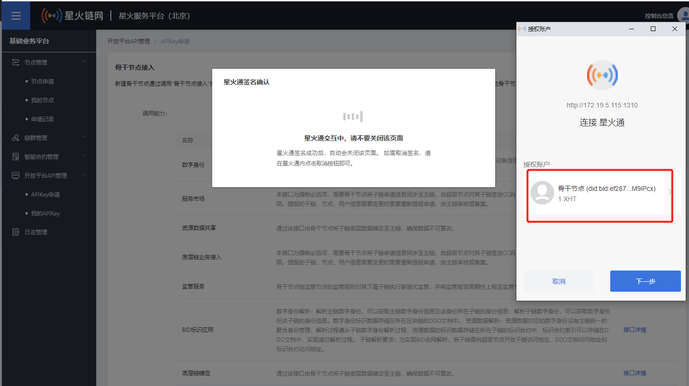


第二步：提交申请后，可以在 APIKey管理里面查询开发者信息。


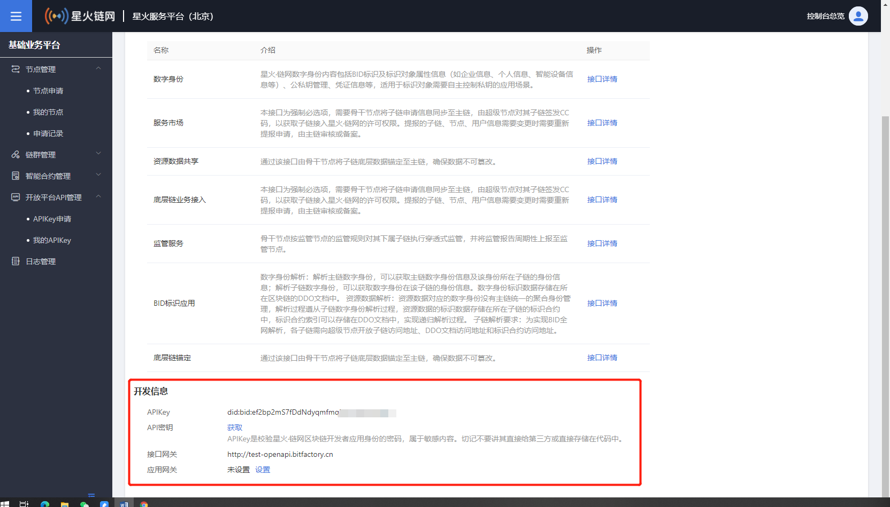


### 1.3.3 底层链锚定

#### 1.3.3.1 [链基础信息同步](https://bif-open-api-doc.readthedocs.io/zh_CN/latest/docs/API%E6%8E%A5%E5%8F%A3/4-%E5%BA%95%E5%B1%82%E9%93%BE%E9%94%9A%E5%AE%9A.html#id2)

#### 1.3.3.2 [链个性化信息同步](https://bif-open-api-doc.readthedocs.io/zh_CN/latest/docs/API%E6%8E%A5%E5%8F%A3/4-%E5%BA%95%E5%B1%82%E9%93%BE%E9%94%9A%E5%AE%9A.html#id3)

#### 1.3.3.3 [链状态信息同步](https://bif-open-api-doc.readthedocs.io/zh_CN/latest/docs/API%E6%8E%A5%E5%8F%A3/4-%E5%BA%95%E5%B1%82%E9%93%BE%E9%94%9A%E5%AE%9A.html#id29)

#### 1.3.3.4 [链节点信息同步](https://bif-open-api-doc.readthedocs.io/zh_CN/latest/docs/API%E6%8E%A5%E5%8F%A3/4-%E5%BA%95%E5%B1%82%E9%93%BE%E9%94%9A%E5%AE%9A.html#id31)

#### 1.3.3.5 [链节点运行状态同步](https://bif-open-api-doc.readthedocs.io/zh_CN/latest/docs/API%E6%8E%A5%E5%8F%A3/4-%E5%BA%95%E5%B1%82%E9%93%BE%E9%94%9A%E5%AE%9A.html#id34)

#### 1.3.3.6 [链的区块信息同步](https://bif-open-api-doc.readthedocs.io/zh_CN/latest/docs/API%E6%8E%A5%E5%8F%A3/4-%E5%BA%95%E5%B1%82%E9%93%BE%E9%94%9A%E5%AE%9A.html#id35)

#### 1.3.3.7 [交易信息同步](https://bif-open-api-doc.readthedocs.io/zh_CN/latest/docs/API%E6%8E%A5%E5%8F%A3/4-%E5%BA%95%E5%B1%82%E9%93%BE%E9%94%9A%E5%AE%9A.html#id38)

#### 1.3.3.8 [合约信息同步](https://bif-open-api-doc.readthedocs.io/zh_CN/latest/docs/API%E6%8E%A5%E5%8F%A3/4-%E5%BA%95%E5%B1%82%E9%93%BE%E9%94%9A%E5%AE%9A.html#id39)

#### 1.3.3.9 [链智能合约调用信息同步](https://bif-open-api-doc.readthedocs.io/zh_CN/latest/docs/API%E6%8E%A5%E5%8F%A3/4-%E5%BA%95%E5%B1%82%E9%93%BE%E9%94%9A%E5%AE%9A.html#id42)

#### 1.3.3.10 [链智能合约部署信息同步](https://bif-open-api-doc.readthedocs.io/zh_CN/latest/docs/API%E6%8E%A5%E5%8F%A3/4-%E5%BA%95%E5%B1%82%E9%93%BE%E9%94%9A%E5%AE%9A.html#id43)

#### 1.3.3.11 [未打包的交易数同步](https://bif-open-api-doc.readthedocs.io/zh_CN/latest/docs/API%E6%8E%A5%E5%8F%A3/4-%E5%BA%95%E5%B1%82%E9%93%BE%E9%94%9A%E5%AE%9A.html#id44)

#### 1.3.3.12 [底层链节点故障日志同步](https://bif-open-api-doc.readthedocs.io/zh_CN/latest/docs/API%E6%8E%A5%E5%8F%A3/4-%E5%BA%95%E5%B1%82%E9%93%BE%E9%94%9A%E5%AE%9A.html#id45)

#### 1.3.3.13 [获取区域信息](https://bif-open-api-doc.readthedocs.io/zh_CN/latest/docs/API%E6%8E%A5%E5%8F%A3/4-%E5%BA%95%E5%B1%82%E9%93%BE%E9%94%9A%E5%AE%9A.html#id46)

### 1.3.4 底层链业务接入

#### 1.3.4.1 [链应用服务信息同步](https://bif-open-api-doc.readthedocs.io/zh_CN/latest/docs/API%E6%8E%A5%E5%8F%A3/3-%E5%BA%95%E5%B1%82%E9%93%BE%E4%B8%9A%E5%8A%A1%E6%8E%A5%E5%85%A5.html#id12)


