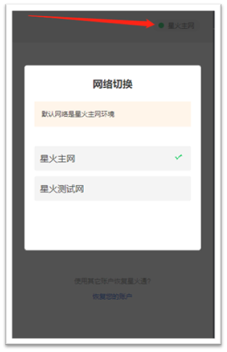
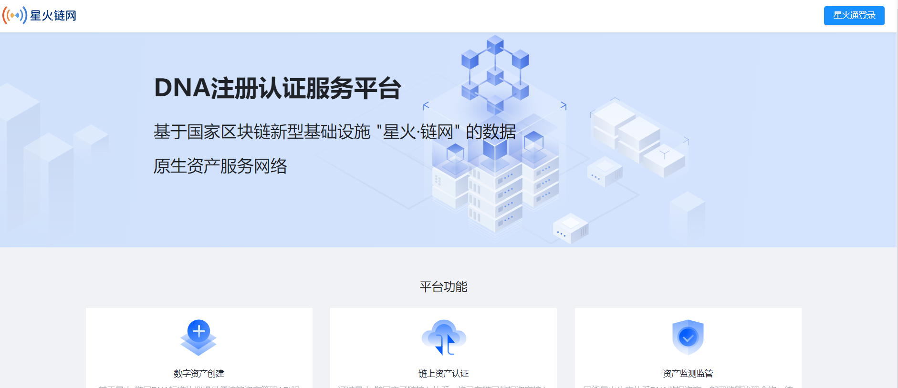
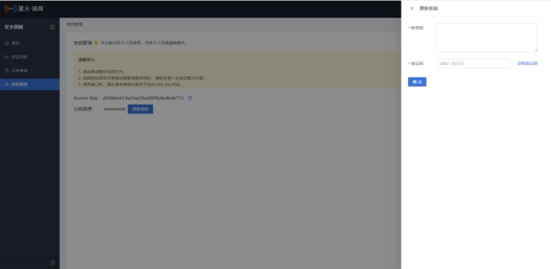
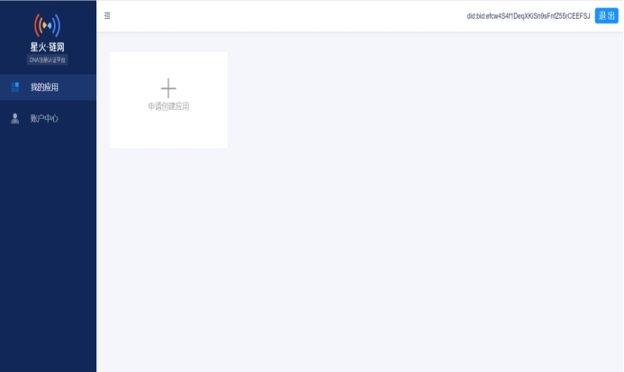
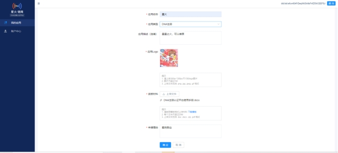
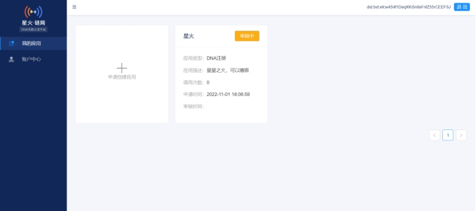
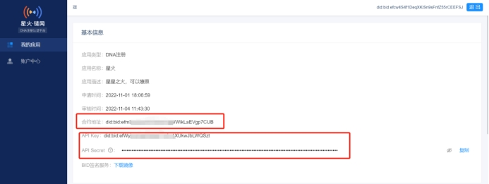

# 1.数字原生资产接入指南

## 1.1简介

欢迎使用“星火·链网”DNA（数字原生资产）公共服务网络-DNA注册认证平台。

DNA注册认证平台在星火·链网的主链，将基于DNA协议（基于`ERC721`改造的星火链网数字原生资产协议）部署的DNA合约封装为标准化`API`，提供链上注册数字资产、转移数字资产等接口服务，方便客户快速基于星火主链构建数字藏品等链上数字资产应用。

## 1.2编写目的

本文档旨在指导企业接入DNA注册认证平台，包含接入流程、开发规范。接入方式**先通过DNA测试网络平台进行测试验证**，接入测试成功后再接入超级节点正式系统，进入正式网络开发时，需与业务发展部同事联系确认。

## 1.3 环境

1)测试网：

DNA注册认证平台：[https://test-dna.bitfactory.cn/manage](https://test-dna.bitfactory.cn/manage)

DNA官网：[https://test-dna.bitfactory.cn](https://test-dna.bitfactory.cn)

DNA浏览器：[https://test-dnascan.bitfactory.cn](https://test-dnascan.bitfactory.cn)

2)正式网：

DNA注册认证平台：[http://dna.bitfactory.cn/manage](http://dna.bitfactory.cn/manage)

DNA官网：[http://dna.bitfactory.cn](http://dna.bitfactory.cn)

DNA浏览器：[http://dnascan.bitfactory.cn](http://dnascan.bitfactory.cn)

## 1.4 接入流程

第一步：创建星火账户及企业认证。

安装星火通，通过星火通账户创建星火企业账户，并完成企业认证。具体操作指引详见[浏览器插件钱包](https://bif-doc.readthedocs.io/zh_CN/latest/tools/wallet.html)章节。

注意：测试阶段需要在“星火测试网”创建星火通账户并完成企业认证；应用对接阶段需要重新在“星火主网”创建星火通账户并完成企业认证。

第二步：签署协议及申请准入。

完成相关协议签署后邮件联系运营方（邮箱），通过”DNA注册认证服务平台”提交星火账户（BID）、企业认证材料、应用平台资料，获取apiKey及apiSecret。

注意：

1.apiKey开发者的身份ID，可用于获取接入方的调用凭证（access_token），然后通过接口调用凭证再来访问数字资产注册认证平台API。

2.apiSecret开发者身份ID对应的密钥，配合API_key使用能够获取接口调用凭证，同时为了安全起见这个密钥需要妥善保管。

3.测试阶段登录测试网的DNA注册认证平台，应用对接阶段登录正式网的DNA注册认证平台。

第三步：接入测试。

在测试网进行应用接入测试，调用DNA相关接口。

第四步：应用对接。

通过正式网的DNA注册认证平台申请应用，获取apiKey/apiSecret，完成应用在正式环境对接。

## 1.5 平台注册

通过星火通插件钱包，出示可信企业凭证完成签名，登录DNA注册认证平台。申请应用获取apiKey/apiSecret。

第一步：登录平台

第二步：出示凭证

 

第三步：创建应用

 

 第四步：按DNA注册认证平台要求完成应用创建

 

第五步：等待审核中

 

第六步：审核通过，获取apiKey/apiSecret

 

获得数据：智能合约地址、APIkey和secret、BID签名服务。根据DNA数字资产API接口完成企业端平台对接开发工作。

