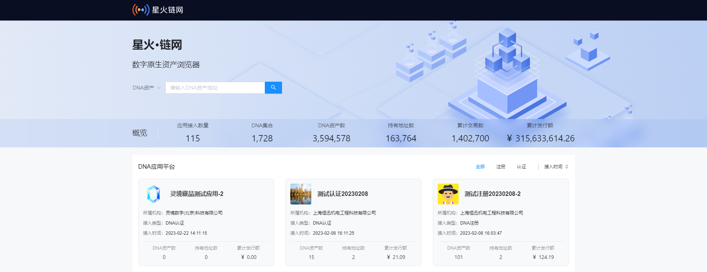
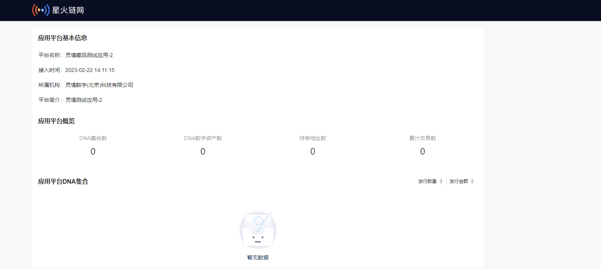

# 4.数字原生资产浏览器

**[数字原生资产浏览器](https://test-dnascan.bitfactory.cn/)**

## 4.1产品概述
数字原生资产浏览器是星火·链网上的一种数据可视化工具，用户可以通过web页面，直接在浏览器上查看星火·链网的注册认证的DNA资产。

## 4.2 功能模块

### 4.2.1 概览信息
星火·链网主链数字原生资产的总体性概览，可以查看应用接入数量、DNA集合、DNA资产数等等。 

### 4.2.2 应用详情
在数字原生资产浏览器中，可查看基本信息。 

## 4.3 应用场景
数字原生资产浏览器作为星火·链网的开放功能，任何人都可以从浏览器获取星火·链网主链上注册认证的DNA资产详情。 星火·链网用户可以在资产注册转移执行后，通过数字原生资产浏览器核验链上的记录。

