# 1.智能安全金融服务ISF

## **1.1.产品概述**

为提升地方政府、企业的产业金融服务支持能力，真正将区块链服务到实体经济中，解决小微企业融资难、融资贵的问题，以信通院和工信部牵头打造国家级底层基础设施星火·链网，搭建星火·链网智能安全金融服务网络，实现各地政府通过星火·链网一次对接多处复用的高效协同模式。

主链旨在提供更强大的基础服务能力，满足跨区域、跨系统、跨机构协作、互信、共享的需求。主链ISF服务网络提供了数字身份、BID标识、链上签等公共基础服务，同时，还提供了账户服务、清结算服务、融资服务、贸易真实性验真等行业基础服务。

骨干节点根据地方政府、区域产业的需求灵活构建支持全产业链的星火产融平台，主要以债权信用、数据信用、物权信用为基础构建产融协同平台，快速实现产融业务的落地及推广。同时骨干节点允许其他产融平台高效接入，满足其他产融平台对区块链的需求，并且利用星火·链网让金融资产更可信，实现金融资产跨区域、跨机构、跨系统之间的高效共享及协作。以扩大互通为目的，接入行业、区域应用，构建行业、区域的产业生态集群发展模式。

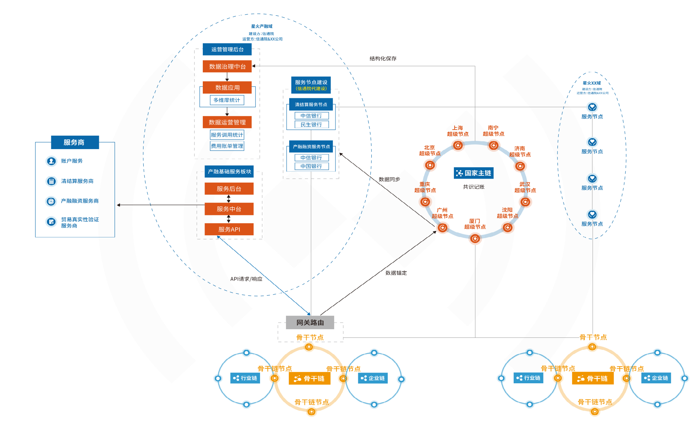

## **1.2.产品特点**

**共享**：通过主链产融域保障数据安全及隐私，真正形成数据共享网络，解决金融过程中的“跨区域”“跨机构”“跨系统”的协同问题。

**安全**：与服务商建设服务节点，解决金融过程中真实意愿传输及“信息二清”等安全问题。

**公信力**：国家级区块链作为底层技术支撑，数据更加安全可靠。

**规范**：通过制定一系列标准，降低地方对金融及科技的要求，聚焦在产业业务端。

**降本增效**：基础服务一次对接多处复用及完善的产品体系，降低地方建设产融平台的投入，缩短建设周期；建设标准和解决方案的输出，便于骨干节点快速搭建产融平台；标准化运营解决方案，方便地方产融平台规模化作业。

## **1.3.ISF服务模块**

**实名认证服务**：星火产融域集成主链的实名认证服务，为骨干节点产融平台提供企业、个人身份认证能力。

**BID标识服务**：星火产融域集成主链的BID标识服务，为骨干节点产融平台提供BID注册、解析服务。

**合同服务**：星火产融域集成主链的链上签服务，为骨干节点产融平台提供链上签约能力。

**账户服务**：集成银行产品为产融平台提供开户申请、开户审批、子账户分配、结算户与子账户绑定等功能。

**发票验真服务**：集成发票验真服务商向产融平台提供OCR识别（单张/批量）、发票验真以及发票存证等服务。

**清结算服务**：产融平台依托清算服务可生成资金清算明细，核心企业付款时依托结算服务可完成付款生成结算明细。

**融资服务**：集成多类型融资渠道，为供应商、经销商提供全场景的融资服务，把控客户建档、融资申请、贷后预警等。

**债权登记服务**（规划中）：与中登网对接，向产融平台提供应收账款登记、应收账款登记查询、证明查验等服务。

**供应链票据服务**（规划中）：与票交所的应收账款票据化平台对接，向产融平台提供信息登记、票据签发、背书转让以及票据到期兑付等服务。

## **1.4.应用场景**

骨干节点根据地方政府/区域产业的需求灵活构建支持全产业链的星火产融平台，主要以债权信用、数据信用、物权信用为基础构建产融协同平台。同时骨干节点允许其他产融平台高效接入，满足其他产融平台对区块链的需求，并且利用星火·链网让金融资产更可信，实现金融资产跨区域、跨机构、跨系统之间的高效共享及协作。以扩大互通为目的，接入行业、区域应用，构建行业、区域的产业生态集群发展模式。

**1、多级拆转融**

产品介绍：基于核心企业对一级供应商的应付账款，核心企业在星火产融平台向一级供应商签发电子债权凭证，同时在线签署《付款承诺函》，一级以及往后的多级供应商可在平台进行凭证签收、拆分流转、凭证融资，或者持有到期。

适用场景：适合于核心企业的上游产业链长而分散，以弱势中小企业为主的产业场景。比如在基建场景中，对于上游提供人力服务、原材料产品的一级或多级供应商，核心企业处于绝对强势地位，对单家采购量不大，付款账期长。

产品价值：多级产品模式成熟，推广简单，能够减少贷款卡融资反映，触达多级供应商；同时，平台可与企业ERP对接，直接在ERP上对应付账款做确权，提升供应链管理和服务的效率。

**2、订单融资**

产品介绍：本产品旨在解决经销商借助核心企业信用，在接到订单后，需预付货款采购原材料而产生的资金需求。核心企业作为销售订单的发起端，在星火产融平台创建订单并发送给经销商，经销商可以借助于核心企业的信用，向资金方申请订单融资。

适用场景：适合需要提前下订单采购的商业场景，核心企业对订单的排产需要准备时间，同时订单准备或订单生产过程中有融资的需求。

产品价值：可减少核心企业自有负债，帮助中小经销商解决融资的问题，提升经销商对核心企业的合作粘度，提升供应链运行效率。

**3、保兑仓**

产品介绍：中小企业向核心企业采购，依靠核心企业对货物的控制，金融机构对资金不足的下游客户提供融资，锁定未来提货权，提货时还款赎货；核心企业按照指令放货，并承担货物回购（或货物担保、调剂销售）、货物监管等责任。核心企业在平台创建订单，经销商确认订单并申请融资，货物到仓库后，核心企业在平台生成电子仓单，向经销商转移货权的同时，将仓单出质给资金方，经销商按照规定向资金方还款申请赎货。

适用场景：对一些热销需要排期的或价格容易波动的货品，下游经销商因担心货源、货期或价格波动风险等问题，自有资金不足，同时需要提前预付采购，借此锁定货源或者拿到优惠价格。

产品价值：有利于核心企业加快锁定货物销售和回款，降低垫款风险，减少自有负债，扩大下游销售。

**4、资产证券化**

产品介绍：保理商基于核心企业信用，选择核心企业确认付款的应付账款债权作为基础资产，发行供应链金融资产证券化产品进行融资。通过引入证券公司、评级公司、增信公司等资产证券化机构，将产业组合资产证券化后向投资者发行，从而为产业引入更多更优质的资金。

适用场景：产业链上的中小企业供应商受其自身偿债能力的信用影响，直接融资授信额度有限，融资难、融资贵。

产品价值：通过资产证券化，盘活产业链上的优质资产，向投资者发行多样化的有价证券，为产业发展引入更多的优质的资金，降低融资成本。

## 1.5.用户使用手册

### 1.5.1.简介

本章将简要地说明软件操作手册（以下简称本手册）地目的、范围、名词定义和参考文件。

#### 1.5.1.1.手册目的

本手册编写的目的在于告诉星火产融管理（以下简称为本系统）的使用者，本系统提供了哪些功能，以及如何正确地、有效地来使用这些功能。

#### 1.5.1.2.手册范围

本手册首先简要地介绍本系统的结构，然后说明本系统为使用者提供的各项功能及其详细的操作步骤。本手册的使用者为拥有星火·链网插件钱包的企业用户。

#### 1.5.1.3.相关术语

| **术语全称** | **说明**                                                     |
| ------------ | ------------------------------------------------------------ |
| 超级节点     | 拥有主链全量数据，负责链上共识计算，管理产融域，保证可靠安全的出块 |
| 服务节点     | 作为主链的非共识节点，可验证交易，同步主链中的账本数据，面向骨干链/子链提供区块链应用服务 |
| 骨干节点     | 作为主链的非共识节点，可验证交易，同步主链账本内相关数据，为骨干链使用主链应用服务提供跨链网关 |
| 产融域       | 由超级节点和服务节点组成产融域，超级节点负责共识计算，服务节点负责达成业务共识 |
| 直接接入     | 企业用户直接接入星火主链                                     |
| 间接接入     | 企业用户通过选择骨干节点后，代替骨干节点完成产融平台的接入申请 |
| 服务商       | 提供星火产融服务的服务商，包括账户服务、清结算服务、产融融资服务以及贸易真实性验真服务 |
| 产融平台     | 需接入星火链网智能安全金融服务网络ISF的第三方供应链金融应用平台，简称产融平台 |

#### 1.5.1.4.角色和职责

| **角色**         | **职责**                                                     |
| ---------------- | ------------------------------------------------------------ |
| 企业用户         | 1.在直接接入方式下进行产融平台接入的申请2.在间接接入方式下通过选择骨干节点后，代替骨干节点完成产融平台的接入申请。 |
| 超级节点运营人员 | 1.服务商的接入2.产融平台接入的审核                           |

### 1.5.2.使用说明

#### 1.5.2.1.目标

主链引入产融域，面向用户提供智能安全金融服务能力，包括产融平台的接入、账户服务/清结算服务/发票验证服务/融资服务的开通及调用管理，便于用户基于主链智能安全金融服务能力，快速建设第三方产融平台，满足用户跨区域、跨系统、跨机构协作、互信、共享的需求。

#### 1.5.2.2.业务流程

##### 产融平台直接接入主链

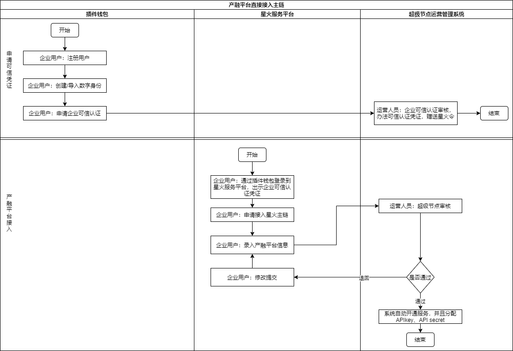

说明：

1.企业用户如果未申请可信凭证，需要先向超级节点申请可信凭证；

2.企业用户如果已获得可信凭证，可通过以下两种方式进入到星火产融服务ISF：

 (1) 企业用户登录星火服务平台后，选择其他服务->星火产融服务ISF后，在新的页面完成钱包授权后登录。

 (2) 企业用户直接通过星火产融服务ISF的独立的入口完成钱包授权后登录。

##### 产融平台间接接入主链

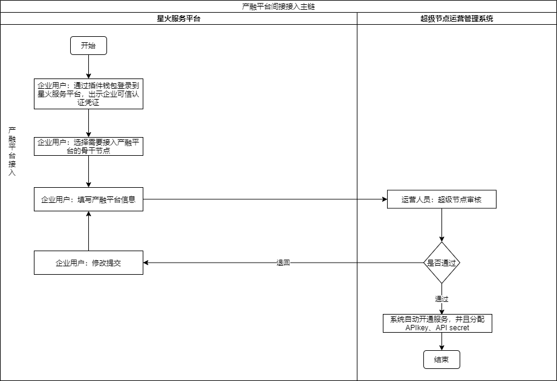

#### 1.5.2.3.功能清单

| 功能类别     | 子功能                       | 描述                                                         |
| ------------ | ---------------------------- | ------------------------------------------------------------ |
| 产融平台接入 | 接入申请                     | 企业用户根据实际的需求选择直接接入或者间接接入。 （1）方式一：企业用户直接申请接入星火主链。 （2）方式二：企业用户通过选择项下骨干节点，代替骨干节点完成产融平台的接入申请。 |
| 接入查询     | 记录企业用户接入申请后的记录 |                                                              |
| 服务配置查询 | 服务配置查询                 | 展示运营人员已经添加后的记录。                               |
| 产融服务开通 | 开通记录                     | 记录运营端产融接入审核通过后的记录。                         |
| 账单管理     | 服务调用账单                 | 根据运营端服务配置管理中配置的规则按自然月出账单，账单数据为产融平台调用产融中台的数据，按照不同的服务类型进行账单的生成。 |

### 1.5.3运行环境

#### 1.5.3.1.硬件

本系统部分功能为浏览器访问，使用常规笔记本、台式机均可；部分功能需要下载安装包进行安装，使用常规手机即可。

#### 1.5.3.2.软件

优先使用chrome最新版本访问。

### 1.5.4.操作步骤

#### 1.5.4.1.登录

访问星火产融平台，点击【快捷授权登录】通过插件钱包插件，输入账户密码、选择登录的数字身份，授权后完成登录。

说明：需选择已经申请过企业可信认证的数字身份进行登录，否则会提示无权限。若未申请，需先在插件钱包里进行可信认证申请。参考[数字身份服务 — 星火·链网开放文档 (bif-doc.readthedocs.io)](https://bif-doc.readthedocs.io/zh_CN/latest/business/digital_id.html)

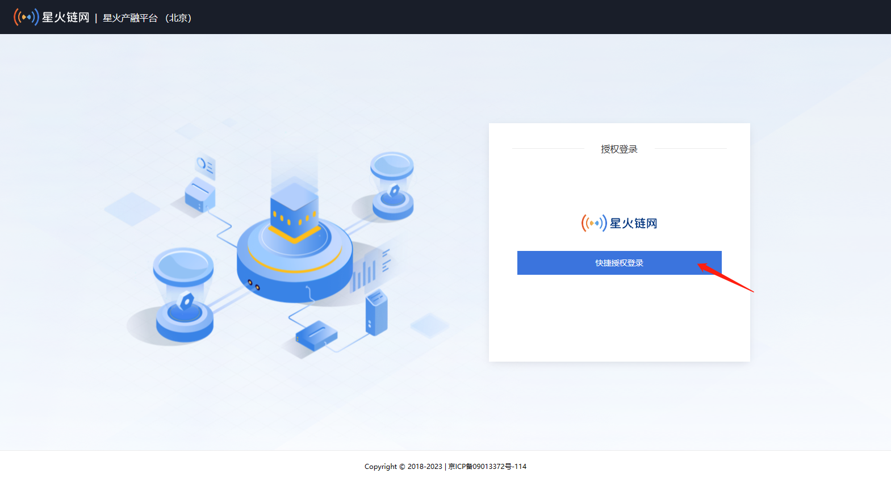

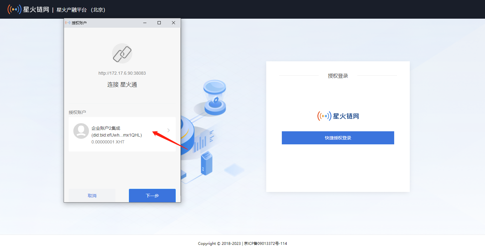

#### 1.5.4.2.出示星火可信认证

登录后左侧菜单默认仅显示一级菜单”星火产融管理”，其他菜单需要企业用户出示星火可信凭证授权后显示。

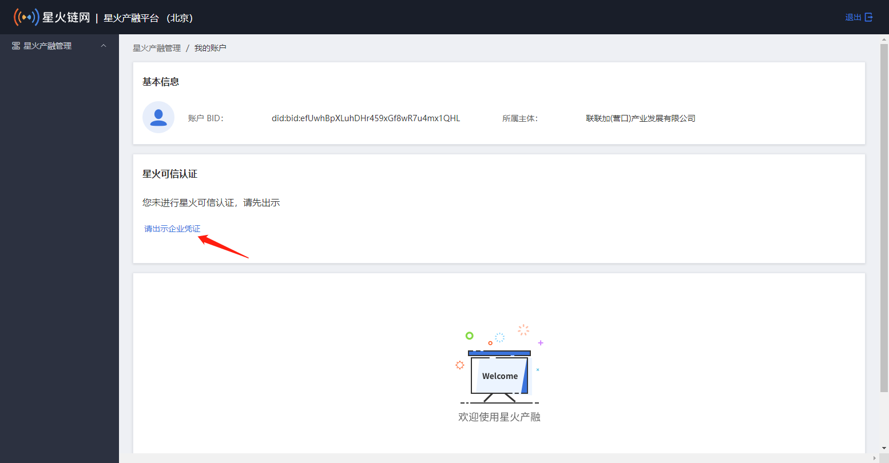

点击【请出示企业凭证】，弹出账户窗口，点击【签名】，提示“操作成功”完成星火可信认证出示。出示凭证后，可看到星火产融管理下二级菜单。

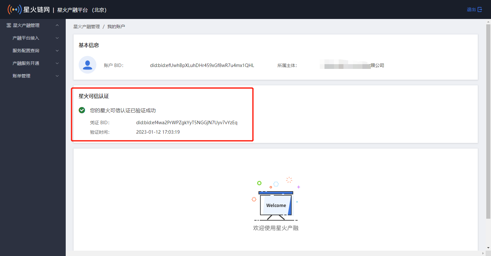

#### 1.5.4.3.产融平台接入

企业用户可进行产融平台的接入，系统支持直接接入和间接接入两种方式，企业用户可根据自己实际的需求进行产融平台的接入申请。选择接入方式，【直接接入】或【间接接入】。

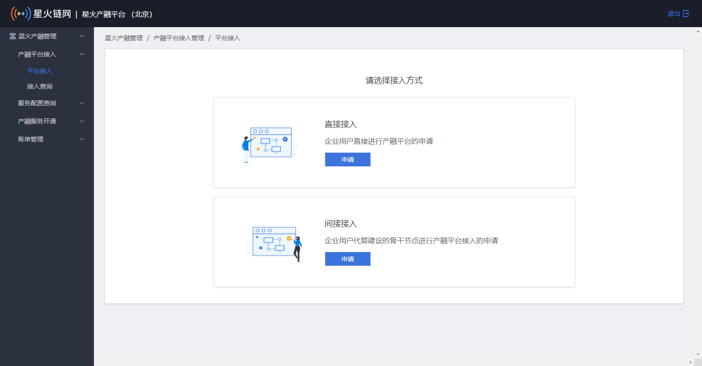

##### 直接接入

企业用户直接进行产融平台的申请。

填写接入信息，包括平台建设方信息、平台基础情况、平台客户情况、平台建设情况、平台在合作中发挥的作用，上传接入材料。

其中《接入申请书》需要在线下载模板进行填写，根据实际要求，加盖公章，上传扫描件。点击【确认】后调用钱包进行签名，提交完成，提示“操作成功”，等待运营方审批处理。

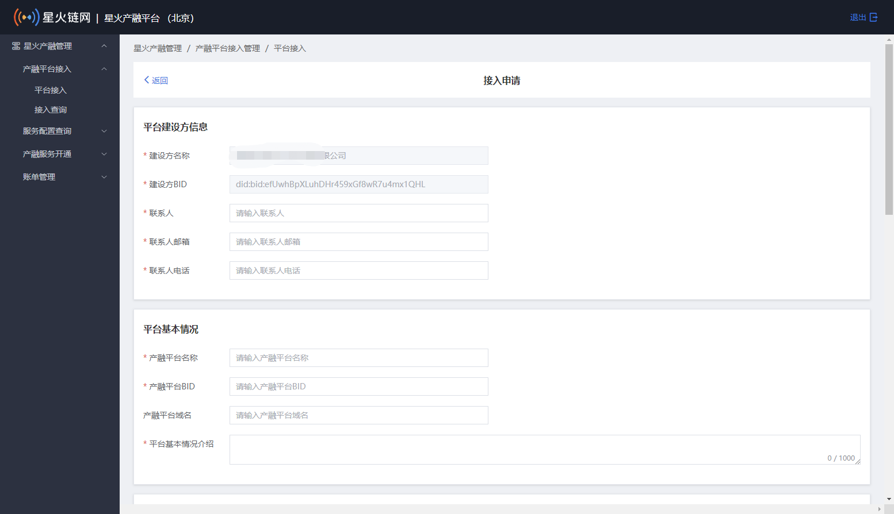

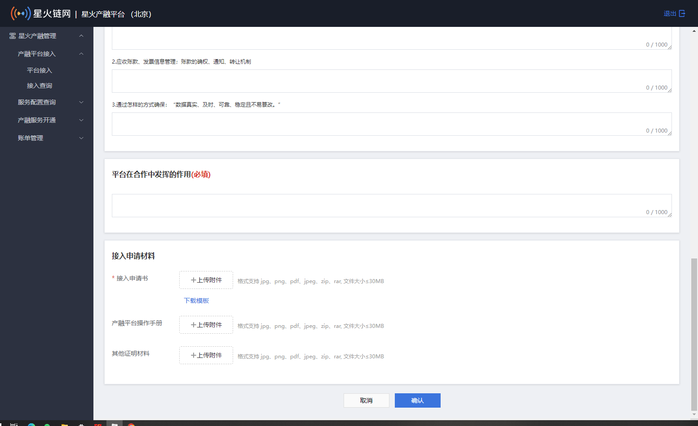

说明：产融平台BID需提前准备，用户可通过插件钱包创建一个BID，并通过一笔转账激活该BID。

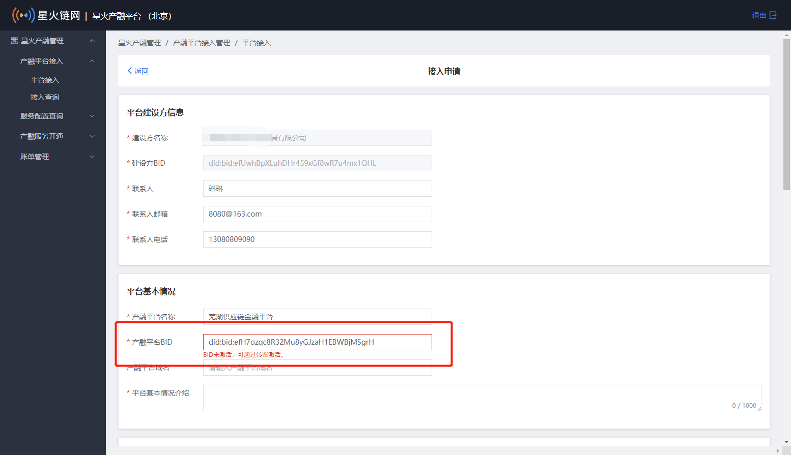

##### 间接接入

企业用户代替建设的骨干节点进行产融平台接入的申请。

前提：该企业身份已申请过骨干节点并通过。即该企业有关联的骨干节点。

选择所属骨干节点，填写平台建设方信息、平台基本情况、平台客户情况、平台建设情况、平台在合作中发挥的作用，上传接入申请材料，其中《接入申请书》需要在线下载模板进行填写，根据实际要求，加盖公章，上传扫描件。点击【确认】后调用钱包进行签名，提交完成，提示“操作成功”，等待运营方审批处理。

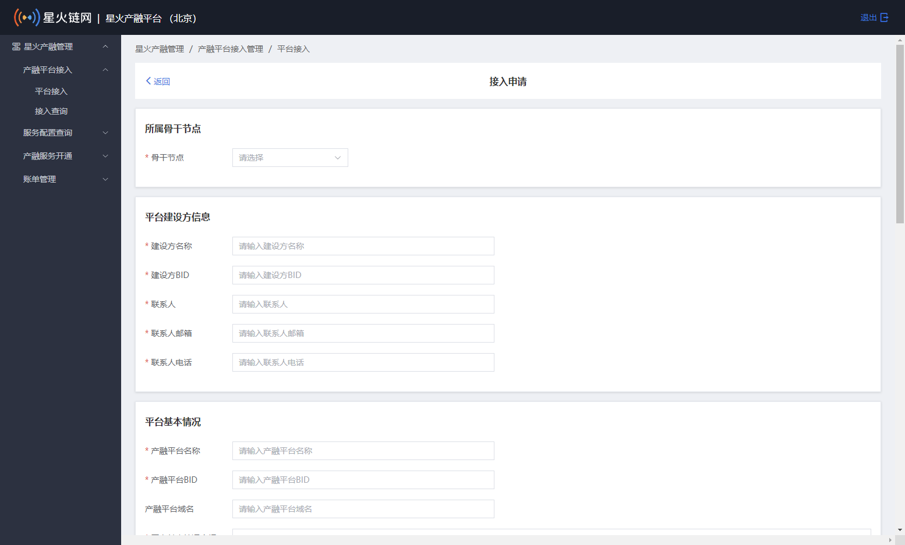

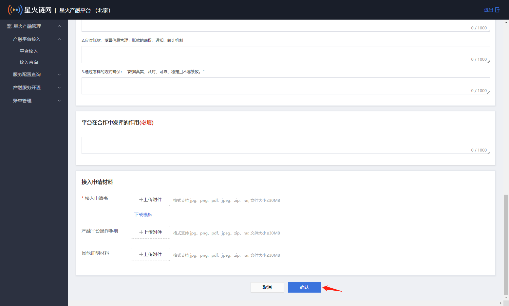

#### 1.5.4.4.接入查询

申请提交成功后，可查看申请记录及状态。

服务平台通过【接入查询】菜单，查看接入审批情况，可以通过产融平台名称、产融平台BID、接入方式、所属骨干节点、申请时间、审批时间进行筛选查询。点击【详情】查看审批申请接入信息。

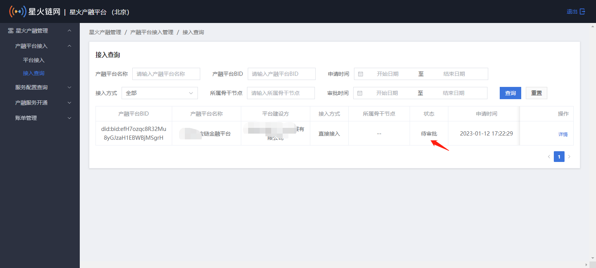

#### 1.5.4.5.服务配置查询

产融平台接入申请审核通过后，用户可查询已开通的相关服务的具体配置情况。

点击【服务配置查询】，查看运营端已添加的服务配置，包括产融平台信息、服务类型、接口次数、有效期、出账日等。

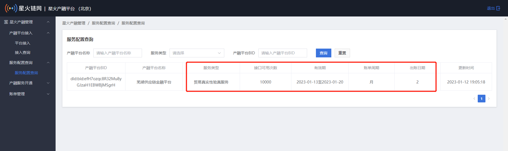

#### 1.5.4.6.产融服务开通查询

产融平台接入申请审核通过后，用户可查看各项服务开通情况。目前ISF提供的服务包含：账户服务、清结算服务、融资服务、发票验真服务。

用户通过产融服务【开通记录】，可以查询运营端配置的服务开通情况。选择需要查看的产融平台，点击【详情】，跳转至服务开通详情页面。

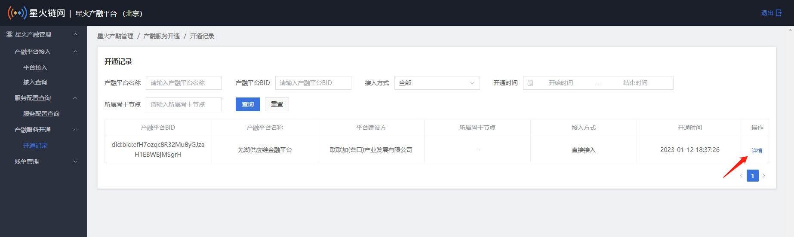

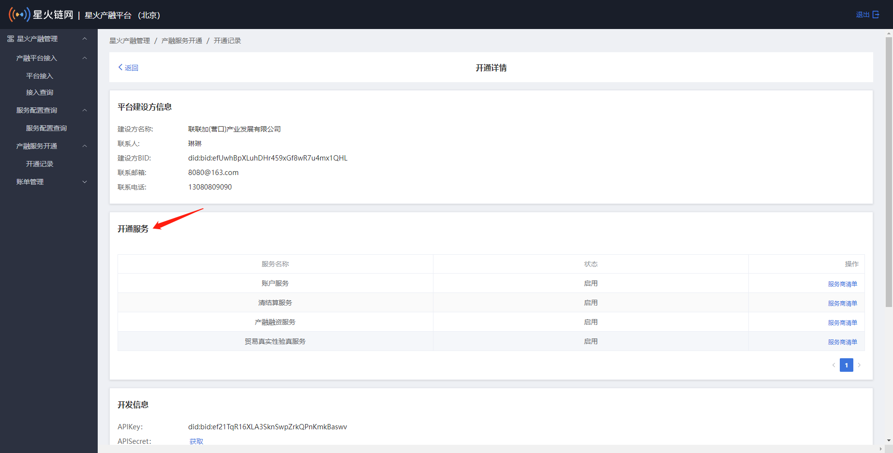

点击【服务商清单】显示每个服务对应的服务商列表。

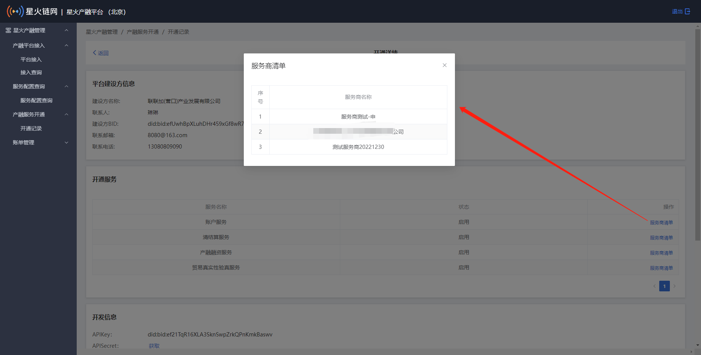

#### 1.5.4.7.账单管理

用户调用各服务接口，使用服务后，平台会输出服务调用账单。根据服务配置管理中配置的规则按自然月出账单，按照不同的服务类型进行账单的生成产融平台调用产融中台的数据。

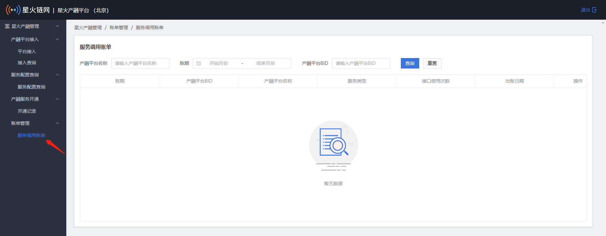

